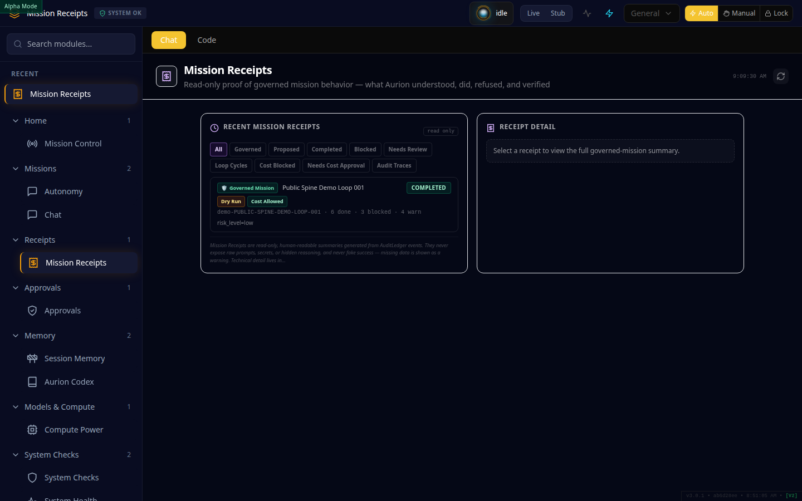
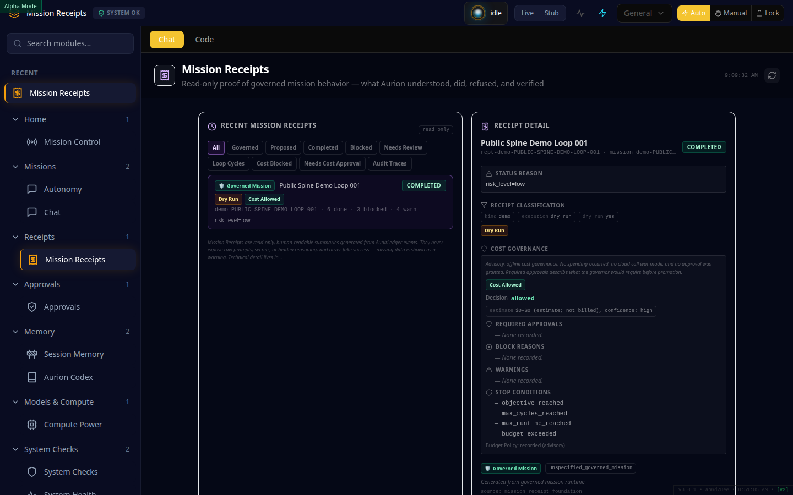
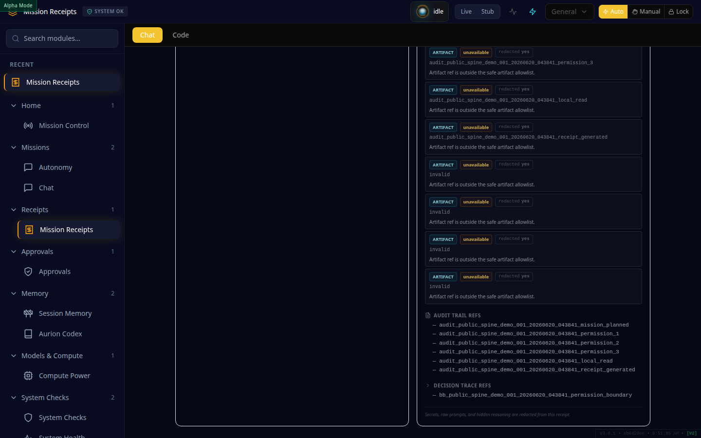
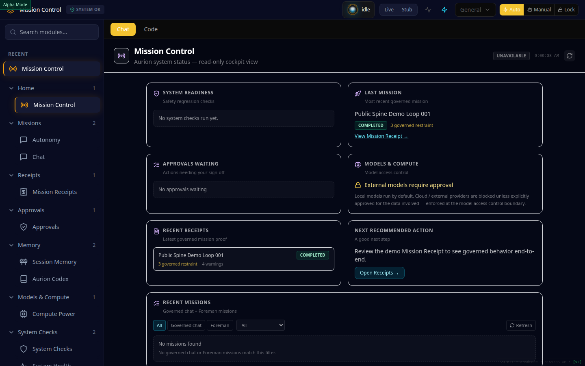

# Aurion Demo Public Alpha — Screenshot Gallery

> Registered by manifest: [`screenshots/manifest.json`](screenshots/manifest.json)
> (`release_context: demo_public_alpha`).

These are rendered through the **real Command Center UI** (production build) against **deterministic
seeded fixtures** built from the genuine `PUBLIC-SPINE-DEMO-LOOP-001` Mission Receipt. They are **demo,
fixture-backed screenshots — not full-stack production screenshots.** No secrets, no private paths.

Together they do **not** claim production readiness, full public alpha, enterprise readiness, or live
autonomy.

---

## 1. Command Center shell (Mission Control cockpit)

- **Caption:** Aurion Command Center home cockpit (`/mission-control`) showing the public spine demo
  receipt, system readiness, approvals, and recommended next step.
- **What it proves:** the local-first Command Center renders a governed mission cockpit with the demo
  receipt present and honest readiness panels.
- **What it does not prove:** full public alpha, production readiness, or that every module/feature is
  complete.
- **Safe for public demo:** yes — no secrets, tokens, private paths, or personal data.

## 2. Mission Receipts list

- **Caption:** Read-only Mission Receipts list showing the Public Spine Demo Loop 001 receipt (Governed
  Mission, Dry Run, Cost Allowed, COMPLETED).
- **What it proves:** governed missions produce inspectable, read-only receipts (no run/approve/override
  controls in this view).
- **What it does not prove:** live autonomy, real execution of side effects, or a general usable
  release.
- **Safe for public demo:** yes.

## 3. Public spine demo receipt detail

- **Caption:** Detail view of the public spine demo Mission Receipt: status, receipt classification
  (dry run), and cost-governance evidence (decision: allowed, estimates, stop conditions).
- **What it proves:** a Mission Receipt carries plan/status/classification and advisory cost-governance
  evidence in a human-readable form.
- **What it does not prove:** that real spending occurred or that cloud escalation is production-ready
  (cost evidence is advisory/read-only; this run is a dry run).
- **Safe for public demo:** yes.

## 4. Demo governance evidence (permissions / audit / decision trace)

- **Caption:** Governance evidence on the demo receipt: AuditLedger refs, BlackBox decision-trace ref,
  and honestly-labelled unavailable artifact refs (missing data shown as unavailable, never fake-green).
- **What it proves:** the spine records AuditLedger references and a BlackBox decision-trace reference,
  and surfaces missing data honestly as *unavailable*.
- **What it does not prove:** that all actions/side-effects are permission-governed, or that the full
  audit/trace stack is complete across the product.
- **Safe for public demo:** yes.

## 5. Alpha mission-control status surface

- **Caption:** Mission Control status cockpit showing honest readiness: no system checks run yet,
  external models require approval, demo receipt as governed proof — unavailable states shown honestly.
- **What it proves:** the status surface is honest about what is and isn't ready (e.g. external models
  require approval; unavailable panels are shown as such).
- **What it does not prove:** full public alpha or production readiness — overall status is yellow and
  `public_alpha_ready` is false.
- **Safe for public demo:** yes.

---

*Screenshots are shipped as deterministic, fixture-backed captures; the regeneration toolchain (Playwright + Command Center build) lives in the private Aurion repository and is not part of this public export. The screenshot gate is
manifest-based — see [`ALPHA_STATUS.md`](ALPHA_STATUS.md).*
